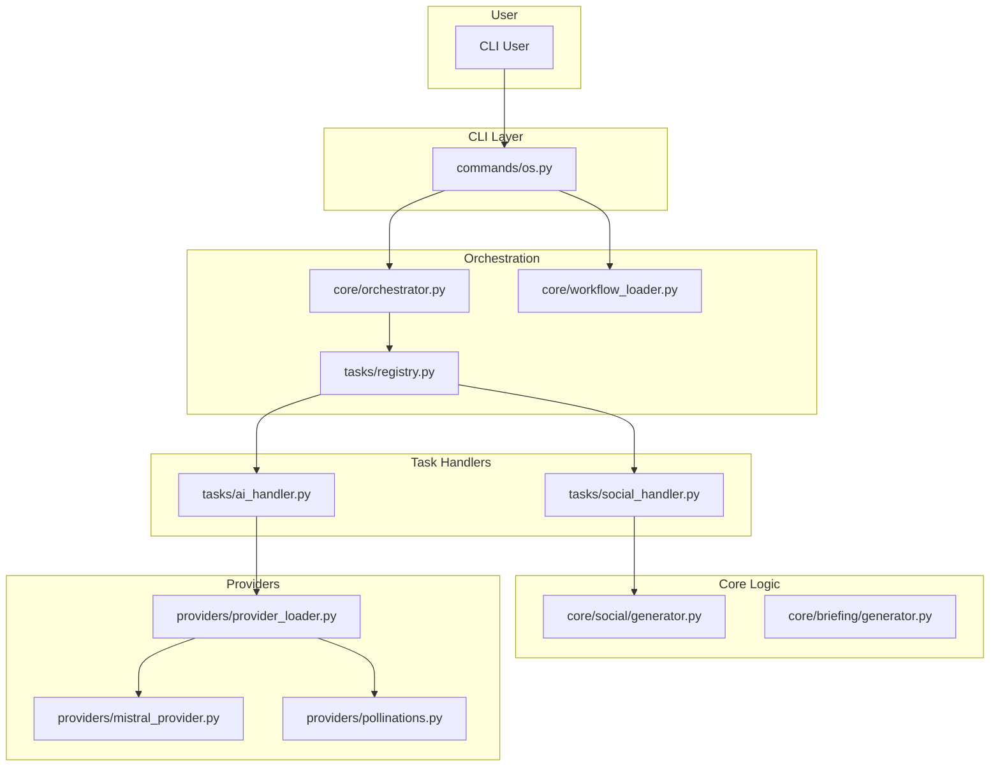

# Architectural Overview

**Generated by:** Project Steward
**Source of Truth:** `CODEBASE_INTELLIGENCE_REPORT.md`
**Date:** 2025-11-08

This document provides a high-level overview of the `agency-toolkit` project architecture, derived solely from the Repo Map.

---

### 1. Modules & Inferred Purpose

The codebase is organized into distinct layers of responsibility:

-   **`cli_app.py` (Entry Point):**
    -   The main entry point of the `typer` application. It handles global CLI options (like `--verbose`, `--json`), loads the configuration, and registers the different command modules as sub-commands.

-   **`commands/` (Controller Layer):**
    -   This is the user-facing layer of the CLI. Each file (e.g., `ai.py`, `social.py`) defines a command group. This layer is responsible for parsing user input and delegating the execution to the appropriate underlying system (`core/` logic or the `os` orchestrator).
    -   **`commands/os.py`** is the specialized entry point for the "Grand Agency OS" workflow engine.

-   **`core/` (Service & Logic Layer):**
    -   This is the brain of the toolkit, containing the pure, reusable business logic, decoupled from the CLI.
    -   **`core/orchestrator.py` & `core/workflow_loader.py`**: The heart of the "Grand Agency OS". `workflow_loader` reads workflow definitions from JSON files in the `registry/`, and `orchestrator` executes the defined sequence of tasks.
    -   **`core/os_executor.py` & `core/os_interactive.py`**: These modules manage the execution flow for the `os` command, handling both interactive user sessions and batch processing.
    -   **`core/social/`, `core/briefing/`, `core/structure/`**: These contain the specific logic for generating their respective artifacts (images, PDFs, folders).

-   **`tasks/` (Workflow Step Layer):**
    -   This directory implements a crucial **Strategy Pattern**. Each `*_handler.py` file is a "Task Handler" that adapts a generic task from a workflow (e.g., `tool: "ai"`) to a concrete implementation. The orchestrator uses the `tasks/registry.py` to dynamically dispatch work to the correct handler. This makes the workflow engine highly extensible.

-   **`providers/` (Adapter Layer):**
    -   A clean plugin system for interacting with external services. `base.py` defines the `TextProvider` and `ImageProvider` interfaces. Concrete classes like `mistral_provider.py` and `pollinations.py` implement these interfaces for specific APIs.

-   **`registry/seeds/` (Data Layer):**
    -   Contains the JSON files (`archetypes.json`, `solutions.json`) that define the executable workflows. This is the "database" for the "Grand Agency OS".

-   **`utils.py`, `models.py`, `exceptions.py`:**
    -   Standard utility modules for configuration loading, Pydantic data models for validation, and custom exception classes.

### 2. Key Dependencies & Coupling

-   **Central Modules (High In-Degree):**
    1.  **`core/orchestrator.py`**: The most critical module. It is called by the `os` command and depends on the `tasks` registry to execute workflows.
    2.  **`tasks/registry.py`**: Central dispatcher for the orchestrator. All task handlers register themselves here.
    3.  **`core/reporter.py`**: Used by almost all `commands/` modules for standardized console output.

-   **Coupling Analysis:**
    -   The architecture is generally well-decoupled, following the flow: `Commands -> Core -> Providers`.
    -   The `tasks/` directory serves as an excellent decoupling layer between the `orchestrator` and the `core` business logic.
    -   **Minor Coupling Point:** The `commands/info.py` module directly imports `providers/mistral_provider.py`. This is a minor violation of the Dependency Inversion Principle, as a high-level command module has a direct dependency on a concrete, low-level implementation. A better approach would be to get this information via the `providers/provider_loader.py` registry.

### 3. Data Flow & Call Graph (Example: `toolkit os init`)

The primary data flow for an orchestrated workflow is as follows:

1.  A user runs `toolkit os init`.
2.  `cli_app.py` routes to `commands/os.py`.
3.  `commands/os.py` uses `core/os_interactive.py` to guide the user through selecting an Archetype and Solution from the data loaded by `core/workflow_loader.py`.
4.  The selected workflow (a list of tasks) is passed to `core/os_executor.py`, which then calls `core/orchestrator.py`.
5.  The **Orchestrator** iterates through each task. For a task like `{ "tool": "ai", ... }`, it queries `tasks/registry.py` to get the `AITaskHandler`.
6.  The `AITaskHandler.execute()` method is called. This handler, in turn, uses `providers/provider_loader.py` to get the appropriate `TextProvider` (e.g., `MistralProvider`) and calls its `generate()` method.
7.  The result is returned to the orchestrator, which stores it in a context object if an `output_key` was defined, making it available for subsequent tasks.

### 4. Visualization (Mermaid)

This graph shows the high-level dependency flow for the "Grand Agency OS".

